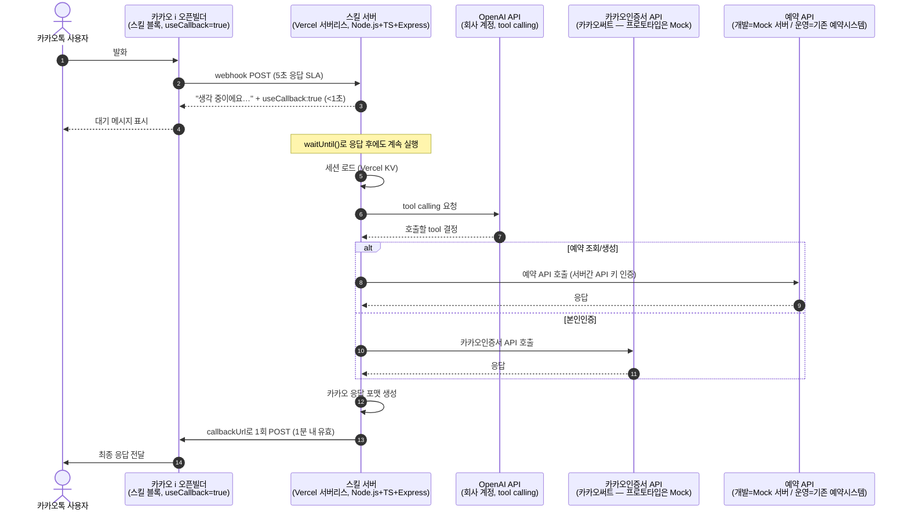

# 기술 설계서 — 카카오톡 + LLM 시설물 사용신청 챗봇

제품 배경·목표·범위는 `0-PRD.md`, 엔티티·용어·정책은 `1-domain-definition.md` 참조. 이 문서는 그 위에서 "어떻게 구현하는가"만 다룬다.

## 아키텍처



카카오 스킬 응답은 5초 SLA가 고정이고 조정할 수 없다. 모든 발화를 **콜백 경로 하나로만** 처리한다(동기/비동기 분기를 만들지 않음). 콜백 URL은 1분간 유효하고 1회만 사용 가능하므로, 콜백 POST 자체는 정확히 1번만 보낸다.

**본인인증은 스킬서버가 직접 소유**한다. 카카오인증서는 카카오 채널에 종속된 인증수단이라, 카카오톡 사용자 컨텍스트를 이미 가진 스킬서버가 인증 요청/결과조회를 직접 처리하고, 검증이 끝난 결과만 `POST /applications` 호출 시 예약 API로 전달한다. 예약서버는 카카오인증서에 대해 전혀 알 필요가 없고, 그 요청이 정말 우리 스킬서버에서 왔는지만 서버간 API 키로 확인한다.

## 배포 / 인프라

- **Vercel**에 Node.js 서버리스 함수로 배포한다. 기존 Express 코드는 어댑터 한 줄로 그대로 재사용 가능(재작성 불필요). HTTPS/도메인이 기본 제공되어 VM 프로비저닝·TLS 갱신·사내 DMZ 협의가 필요 없다.
- 응답을 보낸 뒤에도 백그라운드에서 LLM 호출 + 콜백 POST를 마쳐야 하므로 `waitUntil()`(`@vercel/functions`)로 처리한다.
- **세션 저장소는 Vercel KV**(Redis 호환 매니지드 스토어)를 쓴다. 서버리스는 요청마다 프로세스가 새로 뜰 수 있어 인메모리 Map으로는 대화 상태가 유지되지 않기 때문에, 자체 Redis를 설치하는 대신 Vercel 프로젝트에 스토리지를 추가하는 정도로 가볍게 해결한다. 인터페이스는 get/set/touch/delete 4개뿐이라 코드 변경은 작다.
- Cloudflare Workers는 검토했으나 Express를 Hono 등으로 재작성해야 해서 이번 설계 대비 변경이 더 크다 — 채택하지 않음(엣지 레이턴시·비용상 필요해지면 그때 재검토).
- 비밀값(`OPENAI_API_KEY`, 예약 API 서버간 인증키, 카카오인증서 API 키 등)은 Vercel 프로젝트의 환경변수로 관리한다. 별도 시크릿 매니저 도입은 지금 불필요.

## 대화 상태 관리 (구현)

- 저장소: **Vercel KV**. TTL 30분(유휴 만료).
- 키: 카카오 `userRequest.user.id`.
- 세션 스키마(플레인 객체, 개념은 `1-domain-definition.md`의 ConversationSession 참조):

```ts
{
  step: 'FACILITY' | 'TIME' | 'APPLICANT_INFO' | 'CONFIRM' | 'AUTH_PENDING' | 'DONE',
  facilityId?, date?, startTime?, endTime?,
  applicantName?, applicantPhone?,
  applicationId?, identityVerificationId?,
  messages: [...],  // 최근 10~12턴만 유지, 요약 기능은 만들지 않음
  updatedAt: number
}
```

## 예약 API 계약 (OpenAPI 3.0 초안)

파일: `openapi/reservation.yaml` — 이후 모든 구현의 기준(single source of truth). **운영 시에는 이 계약을 기존 예약 시스템이 구현**하고, 개발 중에는 Mock 서버가 구현한다. 엔티티/에러코드의 의미는 `1-domain-definition.md` 참조. **카카오인증서 연동은 이 계약에 포함되지 않는다** — 스킬서버가 별도로 직접 통신하고, 검증된 결과만 `POST /applications`에 실어 보낸다(아래 "스킬서버 ↔ 카카오인증서" 참조).

- `GET /facilities` → `[{ id, name, type, weeklyHours, maxHoursPerDayPerPerson }]`
- `GET /facilities/{facilityId}/availability?date=YYYY-MM-DD` → 이미 규칙이 반영되어 필터링된 시간대 목록. 챗봇은 이 응답만으로 버튼을 만들고, 시간 규칙을 직접 하드코딩하지 않는다.
- `GET /applicants/{phone}/quota?month=YYYY-MM` → 월 사용량/잔여
- `POST /applications` — **서버간 API 키로 인증**(스킬서버만 호출 가능). body: facilityId, date, startTime, endTime, headcount, email, groupName?, workPhone?, homePhone?, vehicle, purpose, managePassword, `verifiedIdentity: { provider, txId, name, phone, verifiedAt }`
  - `201` → `{ applicationId, status: "APPROVED" | "REJECTED" }` — verifiedIdentity가 이미 실려있으므로 이 호출 자체가 최종 제출이며 `PENDING_VERIFICATION` 중간상태는 예약서버에 남지 않는다.
  - `409` → errorCode: `APPLICATION_WINDOW_NOT_OPEN` / `MONTHLY_QUOTA_EXCEEDED` / `DAILY_LIMIT_EXCEEDED` / `OUTSIDE_OPERATING_HOURS` / `SLOT_UNAVAILABLE`
- `GET /applications/{applicationId}` → 상태 조회

정책 수치는 스펙 스키마(enum/const)에 박아넣지 않고 사람이 읽는 description 텍스트로만 문서화한다. 챗봇은 API가 돌려주는 errorCode를 자연어로 안내만 하고, 최종 판단은 항상 API 응답을 따른다.

### 스킬서버 ↔ 카카오인증서 (별도 연동, 예약 API 계약 밖)

스킬서버가 카카오써트 API를 직접 호출한다(운영 시). 개념적으로 필요한 호출은 두 가지뿐이다:
- **인증 요청**: 사용자 식별 정보(카카오 userId 또는 전화번호)로 인증 알림 발송 → `identityVerificationId` 반환
- **결과 조회**: `identityVerificationId`로 `PENDING`/`VERIFIED`/`FAILED`/`EXPIRED` 상태와, 완료 시 검증된 이름·전화번호 조회

정확한 요청/응답 스키마는 카카오써트 계약 확정 후 그들의 API 문서를 기준으로 채운다 — 지금은 인터페이스 형태(두 개의 호출)만 고정하고 세부 필드는 열어둔다.

## Mock 서버 (예약 API)

- 자체 **Express 앱**(`mock-server/`). Prism 미채택 — 신청 생성→상태조회처럼 요청 간 상태가 이어지는 stateful 시나리오가 정적 example 매칭보다 직접 구현이 더 적은 코드로 끝남.
- `express-openapi-validator` 미들웨어 하나로 `openapi/reservation.yaml`을 로드해 계약 불일치를 자동 400/500 처리.
- `fixtures.ts`: 시설 6개 고정 + 인메모리 Map(신청/월별 사용시간).
- 매월 25일 13시 오픈 규칙은 짧은 조건문 하나로 흉내낸다.

## Mock 카카오인증서 (스킬서버가 호출하는 대상)

실제 계약 전까지 스킬서버는 진짜 카카오써트 API 대신 이 Mock을 호출한다. 카카오인증서는 브라우저 리다이렉트가 없는 서버간 호출 방식이라, Mock도 웹페이지 없이 API만으로 흉내낸다.

- `identityProviderClient.ts`가 실제/Mock 구현을 감추는 얇은 인터페이스 하나만 두고(`request()`, `getStatus()`), 환경변수로 어느 구현을 쓸지 스위치한다 — 나중에 진짜 카카오써트 SDK로 교체할 때 이 파일만 바뀐다.
- Mock 동작: 요청을 받으면 `PENDING`으로 시작해 짧은 지연(예: 3초) 후 자동으로 `VERIFIED`로 전환하고, `fixtures.ts`에 고정된 테스트용 이름/전화번호를 반환한다.
- 실패/거부/시간초과 시나리오를 테스트하려면 Mock 전용 강제 전환 엔드포인트(`POST /_mock/identity-verifications/{id}/force?status=FAILED` 등)를 하나 둔다.

## LLM 오케스트레이션

- **Tool 6개**: `list_facilities`, `check_availability`, `create_application`, `start_identity_verification`, `check_identity_verification_status`, `get_application_status`. `start_identity_verification`/`check_identity_verification_status`는 예약 API가 아니라 `identityProviderClient`(카카오인증서/Mock)를 호출한다. 별도 도메인 서비스 추상 계층 없음.
- **상태 흐름 강제**: 별도 FSM 엔진 없이 세션의 `step` 필드 + 각 tool 핸들러의 짧은 사전조건 체크만으로 처리.
- **본인인증 UX (카카오인증서, 앱 내 승인 방식)**:
  1. 신청서 확인이 끝나면 봇이 `start_identity_verification`을 호출해 인증 알림을 보내고, "카카오톡에서 본인인증 알림을 보내드렸어요. 알림을 눌러 지문(또는 PIN)으로 승인해 주세요"라고 안내한다. 카카오인증서가 처음인 사용자는 이름 등을 한 번 더 입력하는 등록 절차가 추가될 수 있다는 점도 짧게 안내한다("인증서가 처음이시면 조금 더 걸릴 수 있어요").
  2. 세션을 `AUTH_PENDING`으로 두고, "승인을 마치신 후 카카오톡으로 돌아와서 아무 말씀이나 입력해 주세요(예: '완료')"라고 안내한다 — 스킬 서버는 사용자가 먼저 말을 걸어야만 응답할 수 있어(프로액티브 푸시 불가), 완료 여부를 즉시 알려줄 수 없기 때문.
  3. `AUTH_PENDING` 상태에서 사용자가 아무 메시지를 보내면, LLM에 자유롭게 해석시키지 않고 오케스트레이터가 바로 `check_identity_verification_status`를 호출한다. `VERIFIED`면 검증된 이름·전화번호로 `create_application`을 호출해 신청을 확정, `PENDING`이면 "아직 승인이 확인되지 않았어요, 알림을 확인해 주세요" 재안내, `EXPIRED`/`FAILED`면 처음부터 다시 안내.
  4. 카카오 알림톡/친구톡을 통한 자동 푸시는 이번 범위에서 채택하지 않음(비즈니스 메시지 발신 프로필·템플릿 사전승인 등 추가 계약이 필요해 공수가 커짐) — 사용자가 직접 돌아와 입력하는 방식으로 충분히 단순함을 우선한다.
- **시니어 친화 UX 규칙** (시스템 프롬프트 + 응답 포맷터에 반영):
  - 자유 텍스트는 최초 발화, 이름, 전화번호에만 요구(신청자 이름·전화번호는 카카오인증서 검증 결과를 쓰므로 실제로는 타이핑받지 않음 — 예약인원·단체명·방문목적 등만 자유 텍스트로 받음). 시설/날짜/시간 선택은 카카오 quickReplies/listCard로 즉시 버튼화.
  - 한 턴에 질문 하나만. 매 단계 확인 후 다음 단계로.
  - 오류(인증 실패/LLM 실패/API 다운) 시 항상 "처음부터 다시" + "상담원 연결(전화번호 안내)" quickReply 제공.

## 기술 스택

Node.js + TypeScript + Express(Vercel 서버리스 함수로 배포). 의존성: `express`, `@vercel/kv`, `@vercel/functions`(waitUntil), `openai`(공식 SDK), `zod`(LLM tool-call 인자·외부 API 응답 검증), `express-openapi-validator` + `js-yaml`(Mock 서버 전용). 테스트는 Node 내장 `node:test` + `supertest`. NestJS, 자체 Redis, FSM 라이브러리는 도입하지 않음.

## 디렉토리 구조

```
openapi/
  reservation.yaml
src/
  config.ts
  index.ts
  kakao/
    webhook.ts
    responseFormatter.ts
    types.ts
  session/
    store.ts        # Vercel KV 래퍼
    types.ts
  orchestrator/
    orchestrator.ts
    tools.ts
    systemPrompt.ts
  apiClient/
    reservationApiClient.ts
  identityProvider/
    identityProviderClient.ts   # 인터페이스 + Mock/실제 구현 스위치
mock-server/
  index.ts
  fixtures.ts
  identityVerifications.ts   # Mock 카카오인증서(자동승인 지연 + 강제전환 엔드포인트)
test/
  apiContract.test.ts
  conversation.test.ts
scripts/
  send-test-utterance.ts
.env.example
package.json
tsconfig.json
vercel.json
```

### 구현 순서 (착수 시 참고 — 실제 구현은 별도 지시 시 시작)

1. `openapi/reservation.yaml` 작성 (이후 모든 것의 기준)
2. `mock-server/` 구현(예약 API + Mock 카카오인증서) + `test/apiContract.test.ts` 통과 확인
3. `src/apiClient/reservationApiClient.ts`, `src/identityProvider/identityProviderClient.ts` — 둘 다 mock 대상 동작 확인
4. `src/session/store.ts`(Vercel KV), `src/kakao/types.ts`, `src/kakao/responseFormatter.ts`
5. `src/orchestrator/tools.ts` + `systemPrompt.ts` + `orchestrator.ts` (OpenAI tool calling 연결)
6. `src/kakao/webhook.ts` + `src/index.ts` + `vercel.json` (waitUntil 콜백 흐름 결선)
7. `scripts/send-test-utterance.ts`로 로컬 수동 테스트
8. `test/conversation.test.ts` 골든 시나리오(OpenAI는 fake 클라이언트 주입) 작성
9. Vercel 프로젝트 생성 + KV 연결, 실제 카카오 오픈빌더에 스킬 URL 등록 + 1회 실기기 테스트
   - 전제조건: 카카오 비즈니스 채널/오픈빌더 계정, Vercel 계정, 카카오인증서(카카오써트) 계약은 이번 구현 범위 밖에서 별도 준비 필요

## 에러 처리

- **본인인증 실패/미완료**: `check_identity_verification_status`가 `PENDING`이면 재확인 안내, `EXPIRED`/`FAILED`면 인증 재요청 유도 또는 상담원 연결 안내. 재시도 로직은 카카오인증서(또는 Mock) 쪽 책임, 챗봇은 상태만 중계.
- **카카오인증서 API 자체 다운/타임아웃**: `identityProviderClient`에도 `reservationApiClient`와 동일하게 타임아웃 + 에러 처리를 두고, 실패 시 "지금 인증이 어려워요, 잠시 후 다시 시도해주세요" + 상담원 연결 버튼.
- **OpenAI 호출 실패**: 1회 재시도 후에도 실패하면 고정 안내 문구 + 시설 목록 quickReply로 즉시 복귀.
- **카카오 응답 포맷**: `responseFormatter.ts`에서 quickReply 최대 개수/버튼 텍스트 길이 가드.
- **예약 API(백엔드/Mock) 다운**: `reservationApiClient`에 `AbortController` 기반 5초 타임아웃 + 네트워크 에러 처리 → "지금 접속이 어려워요" + 상담원 연결 버튼.
- 로깅은 `console.log(JSON.stringify(...))` 수준으로 충분.

## 테스트 전략

1. **계약 테스트** (`test/apiContract.test.ts`): mock 서버의 각 엔드포인트 호출 → `express-openapi-validator`가 계약 불일치를 자동 400/500 처리하는지 확인.
2. **골든 대화 시나리오** (`test/conversation.test.ts`): orchestrator에 fake OpenAI 클라이언트를 주입하고 실제 mock 서버 + Mock 카카오인증서를 띄운 상태로 "이번 주 토요일 오후에 풋살장 쓰고 싶어요" → 시간 후보 제시 → 인증 요청 → (Mock이 몇 초 후 자동 VERIFIED) → 사용자 복귀 메시지 → 상태 확인 → 신청 생성 → 완료까지의 시퀀스를 e2e로 검증. 실패/거부 경로는 Mock 강제전환 엔드포인트로 별도 테스트.
3. **실기기 없이 검증**: `scripts/send-test-utterance.ts`로 실제 카카오 웹훅과 동일한 JSON을 로컬 서버에 POST해 콜백 흐름을 눈으로 확인.
4. `npm test` 통과가 완료 기준. OpenAI/실 카카오/실 카카오인증서 연동 테스트는 CI에 포함하지 않고 수동으로만 확인.
5. **실기기·실사용자 테스트(계약 후, 별도 단계)**: Mock으로는 확인할 수 없는 "실제 생체인증/PIN 승인 난이도", "알림 인지 및 대화 복귀까지의 소요시간"은 카카오인증서 계약 완료 후 시니어 실사용자를 포함한 실기기 테스트로 별도 검증해야 한다(`0-PRD.md` 열린 리스크 참조).
